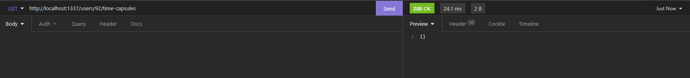
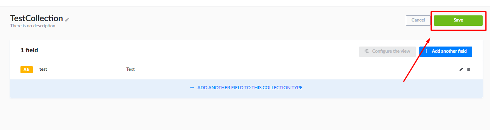
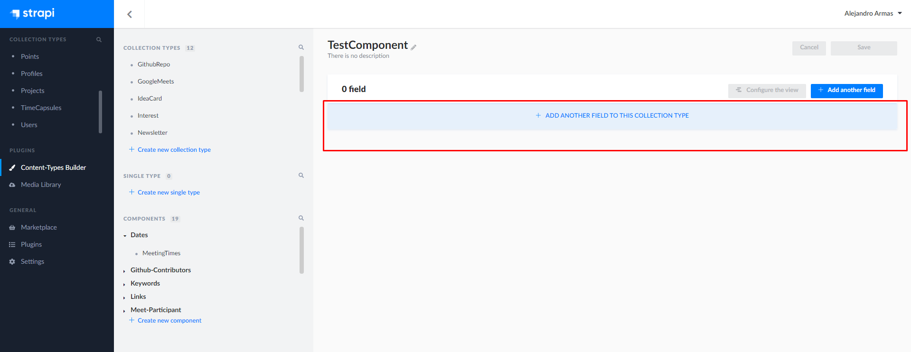

# How to use strapi

# Requirements
1. Make sure you have followed the [contributor guide](CONTRIBUTING.md) to setup the development environment
2. Get ready for a decent amount of reading

# Setup
- Once you've got the development environment setup, then you will be able to
  access the strapi admin dashboard running on http://localhost:1337/admin.
- You'll have to create an admin account to be able to use the strapi dashboard, so
  enter a username and password that you'll remember. It should look like this.
  
- Once you've created an account, we can get into the fun stuff!

# Creating a test user
- To be able to test authenticated routes in the api, you'll need to create a test user
- To create a test user head to the users collection 
- Once on that page, click on "+ Add New Users" on the top right of the screen 
- Once on that page, fill out all these fields since they're required ![Users Fields][./images/how-to-use-strapi/users_fields.png]
- After that, click the green save button on the top right

# Testing the api
- I'm going to be using insomnia in this tutorial, but you can use any other REST client
- If any of the endpoints you want to test are public, then all you need to do is make the request for it
  normally since it doesn't require any authentication
- If one of your endpoints is protected by authentication, and you try to make a request to it without signing in as your test user,
  you'll get a 403 forbidden error .
- To sign in as your test user, make sure to make a POST request to https://localhost:1337/auth/local
  with a JSON object with the keys identifier and password then click the purple send button. Identifier is just your username or email
  of the test user. 
- After signing in, you should get a 200 status code and a response that looks something like this 
- After being signed in, you can now make any requests that require authentication 

# Setting up Google providers
- If you ever need to test the api with a frontend application i.e React then you'll need to
  setup the google provider to be able to login with google to emulate our login system in production.
  However, if you just need to test endpoints without the need of testing the api with a frontend application
  then you can just use postman or any other rest client.
- To setup the google provider, you'll need to go to settings then under users and permissions click "Providers"
- After clicking on "Providers", you should be on a new screen where it lists all the different Providers
  
- Click on the google provider then ping #Alejandro Armas#4672 in the backend chat to get the client id and client secret
- After receiving the client secret, click the enable toggle and fill out the fields
  
- After doing that, click save
- You can now login with google using http://localhost:1337/connect/google

# Creating a collection
- If you ever need related data to be grouped together then you'll need to create a collection
- To create a collection you'll have to go to the content types builder on the left of the
  screen 
- Once on that page, click on "+ create new collection type" 
- When you click on "+ create new collection type" you should see this 
- Make sure when typing in the name of the collection to do so in PascalCase
- Now you should be able to define all the fields and its data types for your collection 
- After defining your collection, all you have to do is click the green save button on the top right of the screen
  
- To add entries to your collection, click on your collection on the left side of the screen.
- On the new page, click the "+ Add new <collection-name>" 
- After filling out all the fields for your entry, click on the green save button on the top right. After clicking that,
  make sure to click the blue publish button 

# Creating a component
- If you ever need reusable structure, then you'll need to create a component
- To create a component, click "+ add another field" in the content-type builder screen
- After clicking on that, click on the component button 
- After that, you can fill out the name of the component.
- You should also fill out the name of the category.
- You can click on any random icon
- There are two types of components
  - Repeatable Components which are best used for multiple instances(If you need an array use this)
  - Single Component which are best for grouping fields like full addresses, main information, etc.
- click on either repeatable component or single component(whichever one fits best for your purposes)
- After that you can add fields to your component by clicking on the "+ Add field to this component"

# Roles
- There are two roles in strapi, Public and Authenticated
- By default, all users have the Authenticated role
- This is important because there will be cases were you only want users who are logged in to
  access some resources and vice versa.
- You can change what role has access to what resource in settings
- To go to settings, click the settings icon on the bottom left of the screen 
- After clicking settings, go to where it says "Users and Permissions Plugin" and click roles 
- After clicking on roles, you should be on a new page where it shows both the Public and Authenticated roles.
- If you want to make it so only a endpoint is accessible to a logged in user, then enable that endpoint for the authenticated role
- To do that, click on the authenticated role
- After that, you should be on a new page with a bunch of checkboxes 
- Find the collection and endpoint you want to allow logged in users to use
- For example, if you want to allow logged in users to be able to make a GET request to /projects to retrieve all projects
  then you'll have to find the projects collection click on the find checkbox then click save on the top right of the screen
  
- After clicking save, you can test by making the http request for the endpoint you enabled
